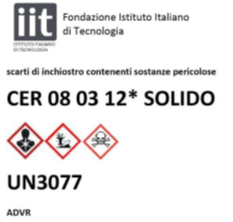

# 
 **PRINTING RULES**

-	New users should be added to the MS Teams “3D Printer Robotics” team – this is done by having the PI contacting the 3D printer administrator (Diego Vedelago – ADVRF)

-	Before putting any job in the queue be sure to register yourself in “Grabcad” with recognizable name and ask the Admin for a preliminary training.

-	Example of recognizable name for John Doe: “ JDoe”. 

-	This is mandatory and helps to refer jobs to people, track budget expenses and so on. 

-	Every User is responsible to start its job accordingly to printer schedule and must extract it when it is finished. 

-	Every 3D printer User have to replace out-of-material cartridges whenever possible.

-	Any jobs longer than 4 hours must be started during night-time .

-	Night-time start at 18:00. 

-	If a User’s job will finish later than 18:00, he must contact the owner of the next job in the queue in order to find with him a way to start night-time job before the end of the day. 

-	Any job longer than 12 hours must be commissioned to IIT’s workshop.

## 
 ***Job/Parts Extractions***

1. Remove plate from printer and let it cool down 30 sec. 
2. Bend the plate in all direction, and then pull the part out - you can use the spatula to help the process.
3. Carefully remove any plastic residual left from the plate. 
4. Put back the CLEANED plate in the printer and secure it. 

## 
 ***ABS Disposal***

-	ABS plastic residues must be disposed in the bin positioned close to the printers and labelled as in figure: 
    
    
    

-	Exhausted cartridge must be placed along with others without any envelope. 

-	Plastic bag or carton box must be disposed in the proper containers 

## 
 ***Night-Time Jobs***

-	If, starting a night-time job (6p.m. or later) the User finds that one of the materials, whether it is support or model, is not enough to complete the print, in order to avoid a halt of the job in the middle of the night, the User should replace the          insufficient cartridge with a new one. 

-	Cartridges with LEFTOVER material must be put in the protective bag of the newly opened ones, labelled with percentage of material left (possibly written directly on the box of the cartridge, near the label) and left close to the printer. 

## 
 ***Tips***

-	You can use STEP files, Stl files as well as Creo prt files.

-	Minimize support material usage by orienting the model on printer plate (e.g. make holes lie flat or try to avoid overhanging parts). 

-	Understand the different option in the “Tray Settings” and “Model Settings” that allow to maximize mechanical resistance and minimize materials usage. 

-	If you have doubts or need help, please contact one of the Facility’s technician. 

## 
 ***Contacts***
Diego Vedelago – 3D Printers Admin – 345 853 8898

Yussef Hassanien – Support technician 

Stefano Cordasco – Technologist - ADVRF Coordinator – 010 2898290

##

Thanks for reading and for the cooperation. 

3D Printers Admin
